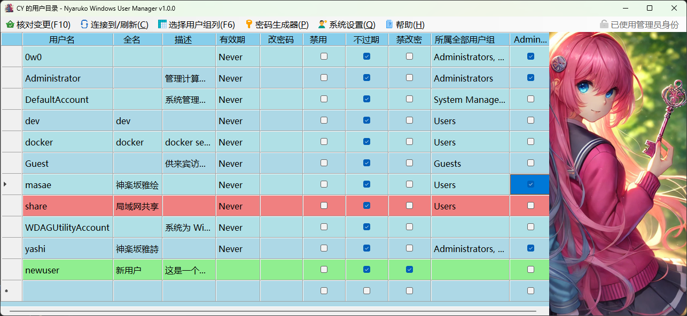
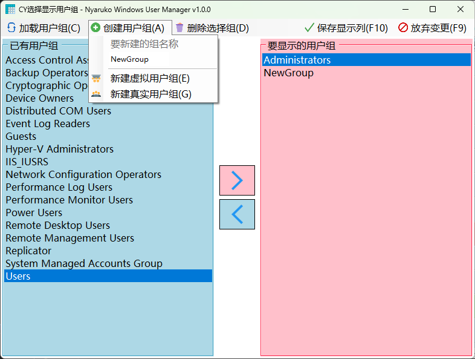
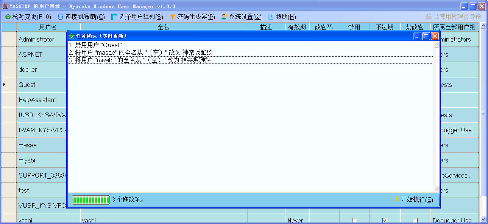

# Nyaruko Windows User Manager

Windows 用户账户快速管理工具

## 为什么会有这个程序？

有人提出了一个**需求**：

“

_要是能像 Excel 一样管理和配置 Windows 账户就好了，尤其是能把我需要的用户组列出来，让我能快速配置权限。_

”

## 它都有什么功能？

- 像编辑电子表格一样管理 Windows 账户 _（废话这不就是需求吗）_
- 批量修改 Windows 账户信息和密码，只需要在表格中填写和修改文字，或者打勾，然后批量执行操作。
  - 修改用户的全名、描述
  - 强制重新修改账户的密码
  - 禁用某个账户
  - 配置密码是否过期
  - 禁止用户修改密码
  - 添加到用户组或从用户组移除
- 管理用户组
  - 将指定的几个用户组添加到主程序的表格列，以便通过勾选快捷设定各个用户的用户组归属。
  - 添加或删除系统用户组。
  - 添加或删除虚拟用户组（即并不实际存在于系统中的用户组，通常用于跨主机管理）。
- 连接到其他主机进行操作。
- 密码和 UUID 生成器。
- 支持在非管理员权限下只读运行。

## 它需要什么环境来运行？

这里仅列出 [Release](releases) 二进制文件所需的系统要求，源代码系统需求请参见 [编译](#怎样从源代码编译) 部分。

### 32位版最低系统需求

- Windows XP SP3 (x86/x64)
- Windows Vista SP1 (x86/x64)
- Windows 7 / Windows 8 (x86/x64)
- Windows 10 (x86)
- Windows Server 2003 SP2 ~ 2008 (x86/x64)
- Windows Server 2008 R2 ~ 2012 (x64)
- React OS 0.4.14 (但功能不可用: 系统尚未实现相关API)
- [.NET Framework 4.0](https://dotnet.microsoft.com/download/dotnet-framework/net40)

### 64位版最低系统需求

- Windows 10 / Windows 11 (x64)
- Windows Server 2012 R2 ~ 2025 (x64)
- [.NET Framework 4.8](https://dotnet.microsoft.com/download/dotnet-framework/net48) (在 Windows 10 1903 和同期 Windows 11 中已经自带)

## 它怎么使用？

### 软件主画面

- 编辑账户
  - 慢速双击可以修改的单元格，即可对这个单元格的内容进行编辑。
  - **如果所有单元格的内容都不可编辑（只读模式）**，请确认右上角是否显示为“已使用管理员身份”，如果没有，可以点击右上角的这个按钮，获取管理员权限。
  - **编辑操作不是实时生效的**，本节列出的所有编辑操作都需要在“核对变更”操作后才会一起执行。你可以放心进行修改。
  - 如果想**撤销所有修改**，按 `F5` 刷新即可。
- 创建和删除账户
  - 在最后一行输入新的用户信息可以新建账户。
    - 即将新建的账户行将会标记为**绿色**。
    - **请一定要先输入用户名，并且输入后不能更改。**
  - 在普通行非编辑状态时按键盘的 `Delete` 键会标记为删除。
    - 即将删除的账户将会标记为**红色**。
    - 删除用户操作**不会一并删除该用户的主文件夹**。可以在操作后去手动删除。
- 用户组管理
  - 在图片中最后一列“是否属于管理员组” ( `Administrators` 组) 是由用户自行添加的列。
  - **每个用户组都可以作为表格的一列**，用于快速配置用户的所属，方便管理权限。
  - 可以使用 `选择用户组列` 菜单来决定哪些用户组作为一列显示在这里，以及管理用户组。
- 额外功能
  - 密码单元格默认为空，即使已经设置密码。任何对密码单元格的修改将视为修改该用户的密码。
  - 选中密码单元格后，可以使用主菜单中的 `密码生成器` 为密码单元格填充一个按你的设置生成的密码。
  - 在连接到菜单，可以连接到其他计算机。**“连接到”和“刷新”操作会放弃所有当前未执行的变更。**
  - 在 `系统设置` 菜单中，可以快速前往各个操作系统自带的设置页。
  - 在移动视窗时，窗口会暂时变为半透明。
  - 在打开本软件时，如果是小屏幕，本软件将会以小尺寸 4:3 窗口启动，并隐藏右侧插图。

### 用户组列配置和管理画面

- 左边将列出**系统中已有的用户组**，你可以选择（支持多选）后将指定用户组移动到右侧列表中，即**要显示为一个列的用户组**，然后按 `保存显示列` 即可返回。
- 支持读取其他计算机的用户组。**“连接到”和“刷新”操作会放弃所有当前未执行的变更。**
- 创建或删除系统中的用户组。
- 创建或删除虚拟用户组（不是系统中实际存在的用户组）。
  - 自行添加的虚拟用户组由于不是系统中实际存在的用户组，所以不能移动到左侧栏，只能**直接删除**。
  - 自行添加的虚拟用户组仅用于跨设备预配置使用，**为用户设置系统中不存在的用户组会导致操作失败**。
  - 在通常情况下，请使用 `新建真实用户组` 。

### 任务列表画面

在主画面所有位置输入完毕后，按“核对变更”即可告诉你将会对系统进行哪些更改：

- 按“开始执行”将应用这些改变到系统 **（需要提前以管理员权限运行本程序）**
  - 将会实时显示操作结果和进度条。
  - **在工作中请勿操作电脑** ，不要随意关闭本程序的任何窗口或结束其进程。
- **这个窗口可以提前打开**，它会根据你对主画面表格的实时修改，实时更新作业列表，直到你按“开始执行”才会真正处理作业。
- 底部的状态栏背景色：蓝色为等待状态，橙色为工作中状态，粉色为结果报告状态。

## 注意事项

- 用户密码修改建议：建议由每位用户自己在系统自带用户设置中自行修改自己的密码。
  - 如果使用 MMC 用户管理控制台或者本程序强制为用户设置密码，并且用户同时使用 NTFS 的 EFS 文件加密功能加密了一些文件，那么这些文件可能将**无法被任何人解密**，除非已经事先[导出 EFS 私钥](https://learn.microsoft.com/troubleshoot/windows-server/certificates-and-public-key-infrastructure-pki/back-up-recovery-agent-efs-private-key)到 `.p12` 文件 。
  - 如果用户使用的是 Microsoft 账户登录，账户的信息和密码由其网络账户决定，将本地账户直接修改后，可能会出现一些问题。
- 用户的建立与删除：建议使用系统自带的 `设置` 来完成用户的建立与删除，系统会自动创建或删除好所需的文件，以及网络注册等操作。
- 错误的操作或者没有被我发现的 BUG 可能导致灾难性后果，建议使用前备份你的系统账户数据库及用户的主文件夹，并且建议在模拟环境中进行初次的试用。**使用本软件对系统造成的任何更改作者不负责。**

## 怎样从源代码编译？

### 编译系统需求

你可以从以下两个方案中启动源代码：

#### 环境1: 为较新操作系统构建

- Windows 10 (64位版) / Windows 11
- Visual Studio 2022 (包含 C# 和 VB.NET 环境)
- .NET Framework 4.0/4.8 SDK (Visual Studio 可能会提示你升级)
- 打开工程文件: `winusermgr.sln`
- 注意: 不支持 `Itanium` 平台

#### 环境2: 为兼容操作系统构建

- Windows XP SP3 (32位简体中文版)
- Visual Studio 2010 (包含 C# 和 VB.NET 环境)
- .NET Framework 4.0 SDK
- 打开工程文件: `winusermgrxp.sln`
- 注意: 不支持大于 4.0 的 .NET Framework 版本

### 编译步骤

以上两种方案打开的都是同一份源代码。

1. 前往 Visual Studio 的 主菜单 → `生成` → `重新生成解决方案` 。
2. 在 `解决方案资源管理器` 窗口中的 `WinUserMgr` 项目点右键，选择 `设为启动项目` 。
3. 如果需要升级 .NET Framework 版本，可以在每个项目点右键，选择 `属性`，然后在 `目标框架` 中选择更新的 `4.x` 版本。
4. 在工具栏中的 `解决方案配置` 选择 `Debug` ，`解决方案平台` 选择你的系统和处理器或 `Any CPU` 。
5. 按 `F5` 运行项目。

请勿直接运行主项目，主项目依赖解决方案中的其他组件，这些组件必须先完成编译才行。

### 打包

当 `解决方案配置` 为 `Release` 时， `重新生成解决方案` 将自动将生成的文件以 `.cab` 格式打包到 `bin/` 中，并包括文档文件。

例如，在 `解决方案平台` 为 `x64` 时，会创建文件 `bin/WinUserMgr_x64.cab` 。

### 使用构建+打包脚本（输出和 Release 相同的文件）

1. 进入[环境2](#环境2-为兼容操作系统构建) 。
2. 在开始菜单中找到并打开 `Visual Studio 命令提示(2010)` (`Microsoft Visual Studio 2010 x86 tools`) 。
3. `CD` 到本项目的根文件夹。
4. 输入 `clean.bat` 执行。该操作会清理上次生成的全部文件。
5. 输入 `buildxp.bat` 执行。该操作会生成文件 `bin\*_Itanium.cab` 和 `bin\*_x86.cab` 。
6. 进入[环境1](#环境1-为较新操作系统构建) 。
7. 在开始菜单中找到并打开 `Developer Command Prompt for VS 2022` 。
8. `CD` 到本项目的根文件夹。
9. 输入 `build.bat` 执行。该操作会生成文件 `bin\*_ARM64.cab` 和 `bin\*_x64.cab` 。

## 许可证 LICENSE

Copyright (c) 2024 KagurazakaYashi(Miyabi) NyarukoWindowsUserManager(WinUserMgr) is licensed under Mulan PSL v2. You can use this software according to the terms and conditions of the Mulan PSL v2. You may obtain a copy of Mulan PSL v2 at: <http://license.coscl.org.cn/MulanPSL2> THIS SOFTWARE IS PROVIDED ON AN "AS IS" BASIS, WITHOUT WARRANTIES OF ANY KIND, EITHER EXPRESS OR IMPLIED, INCLUDING BUT NOT LIMITED TO NON-INFRINGEMENT, MERCHANTABILITY OR FIT FOR A PARTICULAR PURPOSE. See the Mulan PSL v2 for more details.
